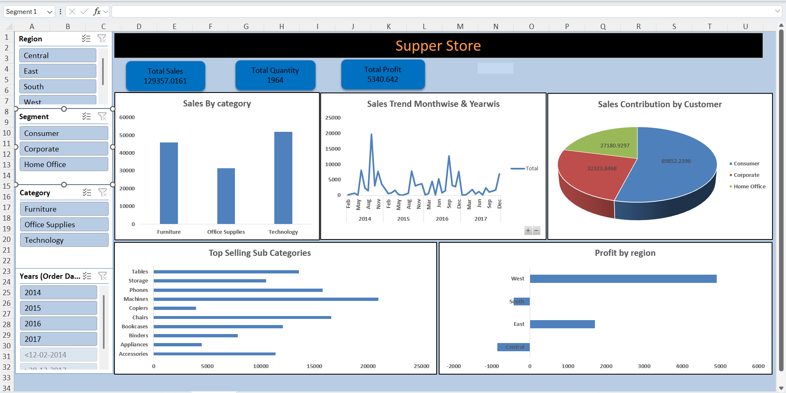

# 📊 Excel Sales Dashboard Project

## 📌 Project Overview
This project analyzes sales data using **Microsoft Excel** to generate meaningful business insights.  
The dashboard helps in tracking sales performance, regional contribution, and profitability trends.

---
## 📸 Dashboard Preview

  

---
## 🛠️ Tools & Techniques Used
- 📑 Microsoft Excel  
- 📊 Pivot Tables  
- 📈 Charts & Graphs  
- 🎛️ Slicers (Interactive Filters)  
- 🧹 Data Cleaning & Data Formatting  

---

## 🔎 Key Insights Generated
- 🏆 Identified top-selling products  
- 🌍 Analyzed sales performance by region  
- 📅 Evaluated monthly sales trends  
- 👥 Measured sales contribution by customer  
- 💰 Compared profit performance across regions  

---

## 🚀 Dashboard Features
- 🎛️ Interactive filters using slicers  
- 📊 Dynamic sales performance analysis  
- 📈 Visual representation of KPIs  
- 📍 Region-wise and customer-wise breakdown  

---

## 👤 Author

**Sourabh Patil**  
📊 Data Analyst | SQL | Excel | Power BI | Python  

📧 Email: patilsourabh1432@email.com  
🔗 LinkedIn: https://www.linkedin.com/in/sourabh-patil-ab01433a0  
💻 GitHub: https://github.com/sourabh1432  
